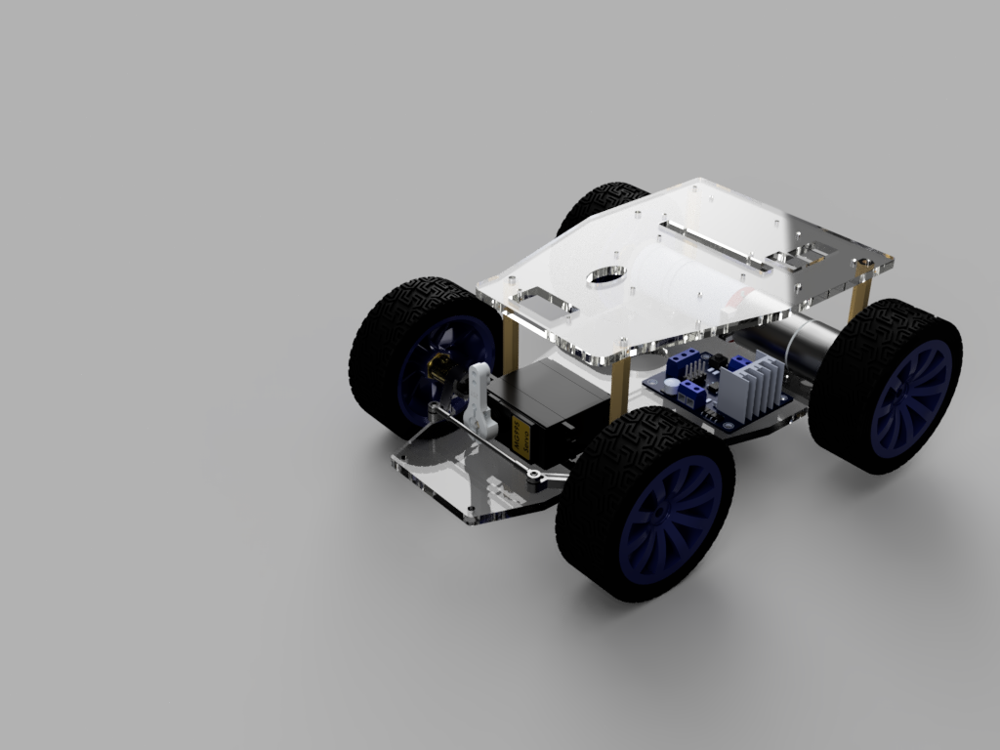

# Slipstream: MPC chases RL

The idea behind Slipstream is to develop a small-scale test-bed at ASAS Labs for running perception, control and localization experiments. The end goal is to translate the subsystems and algorithms to Autoware 1.7 which runs on BuGY! The experiments currently being done are to precisely determine the motion model and identify process and measurement noises. That said, the objective is to demonstrate tandem-drifting on Crickets!


The model that we have worked upon is shown above. Here are some specs of the RC Car itself:

| Parameter | Value |
|-----------|-------|
| Wheelbase | 144.8 mm |
| Track width (front) | 163.5 mm |
| Track width (rear) | 163.5 mm |
| Wheel diameter | 27.0 mm |
| Chassis length | ~230 mm |
| Chassis mass | ~3.0 kg |
| Front wheel mass | ~139 g each |
| Rear wheel mass | ~12.5 g each |
| Servo range | ±30° |
| Max front steer angle | 30° |
| Drive configuration | Rear-wheel drive, locked differential |

> All measurements are derived from the MuJoCo simulation model. Physical verification against the hardware is recommended before running real-world experiments.

---

## Steering

The RC car uses **Forward Ackermann steering geometry** on the front axle. A single servo horn rotates about the longitudinal (X) axis, driving a push-rod column that rotates the left steering cup about the vertical (Z) axis. A tie-rod then transmits the motion to the right steering cup, producing a differential steer angle between the inner and outer front wheels.

For the mathematical derivation of the Ackermann steering equations, forward kinematics, and the ghost-wheel polynomial approximation used in the MuJoCo model, see [ackermann_steering.md](docs/ackermann_steering.md).

---

## Simulation

The simulation is built in [MuJoCo](https://mujoco.org/). To install:

```bash
pip install mujoco
```

Then drag and drop the `.xml` model file into the MuJoCo viewer:

```bash
python -m mujoco.viewer
```

Or launch directly with the model:

```bash
python -m mujoco.viewer --mjcf=path/to/delorian.xml
```

---

## Repository Structure

```
slipstream/
├── meshes/          # STL mesh files exported from Fusion 360 (units: mm, scaled ×0.001 in XML)
├── models/          # MuJoCo XML model files
│   ├── delorian.xml             # Physical linkage steering model (current)
│   └── delorian_ghost_wheel.xml # Ghost-wheel Ackermann model (reference)
└── README.md
```

---

## Notes

- Meshes are exported from Fusion 360 in millimetres and scaled to metres (`scale="0.001 0.001 0.001"`) inside the MuJoCo XML.
- The rear differential is modelled as a locked tendon coupling both rear wheel spin joints with equal coefficients.
- The `centroid` free joint on the rover body is what allows the vehicle to move freely under contact forces from the ground and wheels.