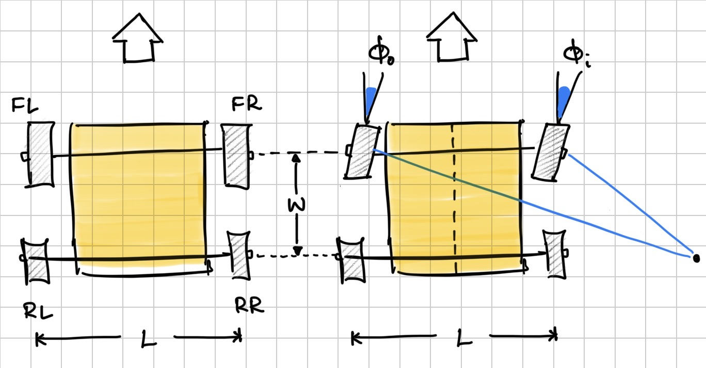

# Ackermann Steering: Mathematical Reference

## Overview

Ackermann steering geometry ensures that during a turn, all four wheels follow concentric circular paths around a common instantaneous centre of rotation (ICR). This eliminates tyre scrub — the inner front wheel must turn at a sharper angle than the outer front wheel because it traces a smaller radius.

---

## Ackermann vs Anti-Ackermann

| Geometry | Condition | Typical Use |
|----------|-----------|-------------|
| **Ackermann** | `δ_i > δ_o` — inner wheel turns sharper | Road cars, low-speed cornering |
| **Anti-Ackermann** | `δ_o > δ_i` — outer wheel turns sharper | Racing, drifting, high-speed cornering |
| **Parallel** | `δ_i = δ_o` — both wheels turn equally | Zero-radius approximation |
| **Partial Ackermann** | Between parallel and full Ackermann | Compromise setups |

In standard **Ackermann**, the inner wheel traces a tighter arc (smaller radius) so it requires a larger steer angle. In **Anti-Ackermann**, the outer tyre carries more lateral load during cornering and benefits from additional slip angle, so the outer wheel is steered more sharply instead.

Most real vehicles sit at a **partial Ackermann** percentage between 0% (parallel) and 100% (full Ackermann).

---

## Geometry and Notation

| Symbol | Description | Unit |
|--------|-------------|------|
| `L`    | Wheelbase | m |
| `W`    | Track width | m |
| `R`    | Turning radius to vehicle centre | m |
| `δ_i` | Inner front wheel steer angle | rad |
| `δ_o` | Outer front wheel steer angle | rad |
| `δ`   | Equivalent bicycle model steer angle | rad |

---

## Core Ackermann Equations

### Outer wheel angle

$$\cot(\delta_o) = \frac{R + W/2}{L}$$

### Inner wheel angle

$$\cot(\delta_i) = \frac{R - W/2}{L}$$

### Ackermann condition (exact)

$$\cot(\delta_o) - \cot(\delta_i) = \frac{W}{L}$$

This constraint must hold for perfect Ackermann steering at any turning radius. Note that `cot(δ_o) > cot(δ_i)` implies `δ_o < δ_i`, confirming the inner wheel always steers sharper.

---

## Solving for Individual Angles Given Turning Radius R

$$\delta_o = \arctan\!\left(\frac{L}{R + W/2}\right)$$

$$\delta_i = \arctan\!\left(\frac{L}{R - W/2}\right)$$

---

## Bicycle Model Equivalent Angle

For control purposes, the vehicle is often reduced to a single-track (bicycle) model with one equivalent front steer angle:

$$\delta = \arctan\!\left(\frac{L}{R}\right)$$

The individual wheel angles can then be recovered from `δ`:

$$\delta_o = \arctan\!\left(\frac{L}{L/\tan(\delta) + W/2}\right)$$

$$\delta_i = \arctan\!\left(\frac{L}{L/\tan(\delta) - W/2}\right)$$

---

## Forward Kinematics

Given steer angle `δ` (bicycle model) and longitudinal velocity `v`, the kinematic equations in the world frame are:

$$\dot{x} = v \cos(\theta)$$

$$\dot{y} = v \sin(\theta)$$

$$\dot{\theta} = \frac{v}{L} \tan(\delta)$$

where `(x, y)` is the vehicle position and `θ` is the heading angle.

The instantaneous turning radius is:

$$R = \frac{L}{\tan(\delta)}$$

---

## MuJoCo Ghost-Wheel Implementation

In the ghost-wheel version of the Slipstream model, the steering differential is approximated by a linear polynomial mapping from the ghost hinge angle `φ` to each front wheel steer angle:

$$\delta_{FL} = 1.05 \cdot \varphi$$

$$\delta_{FR} = 0.95 \cdot \varphi$$

Whether this approximates Ackermann or Anti-Ackermann depends on the car's axis convention — specifically, which physical wheel is on the inside of a turn when `φ > 0`. The wheel with the larger coefficient (1.05) steers more sharply; if that wheel is the inner wheel during a turn, the geometry is Ackermann. If it is the outer wheel, it is Anti-Ackermann.

To verify: command a positive `ghost-steer` input, observe which direction the car turns, and check whether the inner or outer wheel has the larger steer angle.

For higher accuracy, replace the linear coefficients with values derived from the exact equations above:

$$\text{ratio} = \frac{\delta_i}{\delta_o} = \frac{\arctan\!\left(\frac{L}{R - W/2}\right)}{\arctan\!\left(\frac{L}{R + W/2}\right)}$$

evaluated at the nominal operating radius `R`.

---

## RC Car Parameters (Slipstream)

| Parameter | Value |
|-----------|-------|
| Wheelbase `L` | 0.1448 m |
| Track width `W` | 0.1635 m |
| Max steer angle `δ_max` | 30° (0.5236 rad) |
| Min turning radius `R_min` | `L / tan(δ_max)` ≈ 0.251 m |